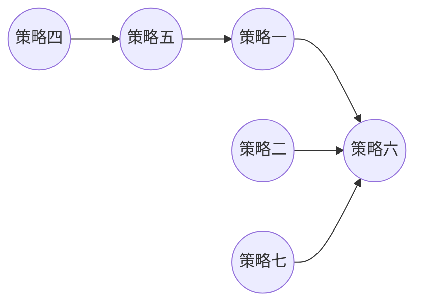

## js递归解决父子关系问题


最近碰到的一个需求，记录下。

问题是：如图所示，要给策略六所在行编辑的时候选择一个父策略，父策略下拉框数据要求来自列表授权策略名称列。
限制条件是：不能是自身（这里也就是策略六），授权策略名称所在行的父策略不能是自身，同时要满足继承关系。（比如说：
第三行中策略六是策略一的父策略，第一行中策略一又是策略五的父策略，那么策略五也就不能成为选择项）


将上列表可以转换为流程图：

由上图可以知道策略六所在行的父策略没有选项。因为策略六是所有策略直接或者间接的父策略。

下面用代码实现：

```js
//点击编辑按钮执行getData，row是所在行数据
	getData(row){
	  let self= this;
      let selfName = this.name.; // 编辑行的授权策略名称
      let list = this.checkSystemList; // 列表数组

      // 获取所有策略名称
      let strategyArr= new Set();
      list.map(item => {
        strategyArr.add(item.strategyName);
      });
      strategyArr.delete(selfName);
	  //递归函数
      function filterName(strategyName) {
        // 找出父策略是编辑行授权策略名称的数据
        let filterArr = list.filter(obj => {
          return strategyName === obj.parentStrategyName;
        });
        if (!filterArr.length) {//出口
          //如果编辑行授权策略名称不是任何行的父策略，则所有选项都能选择
          vm.parentData = [...strategyArr];//可选数据
        } else {
          filterArr.map(obj => {
            if (strategyArr.has(obj.strategyName)) {
              strategyArr.delete(obj.strategyName);
            }
            //递归
            filterName(obj.strategyName);
          });
        }
      }
      filterName(selfName);//入口
	}
```